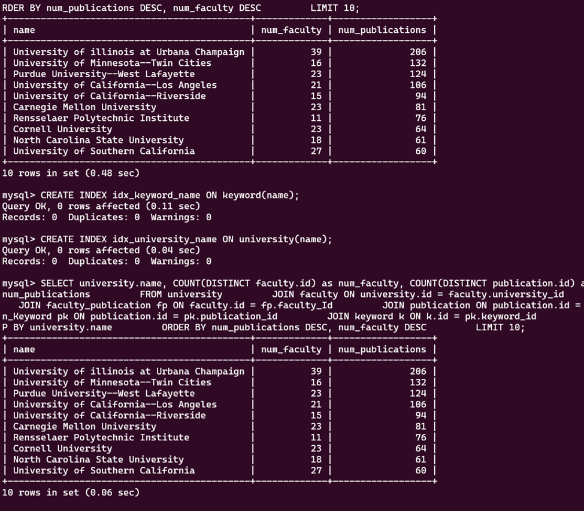
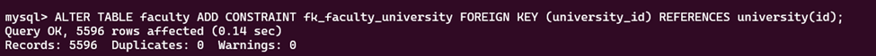
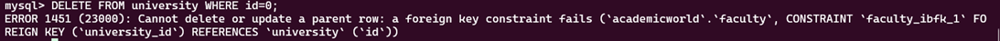
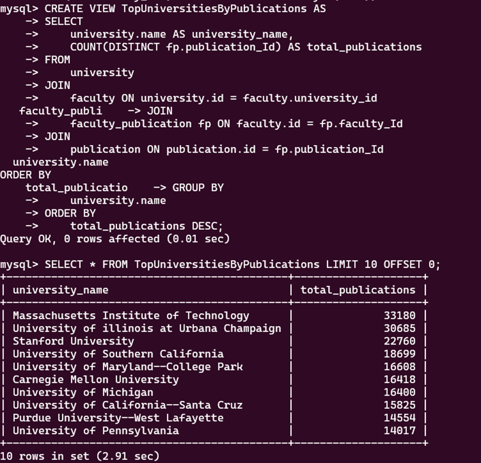

# GraceGibson

Title: Explore Research Impact

Purpose: The application scenario is exploring the research impact of various univerisities and faculty members with respect to publications, citations, and research interests/topics. The target users are current or prospective students who are interested in research and want to determine which universities and faculty members who be best suited to their interests, researchers and/or faculty who want to understand their research impact or find potential collaboraters within their field, and university stakeholders or administrations who want to evaluate the impact of their faculty and university to determine promotions/raises, their ranking, etc. The objectives of the application are to highlight the top universities with the greatest impact in research based on citations and publications, detail the top research areas of specific universities by publication count, the universities and faculty members who have made the most impact in certain research areas, the publications with the most impact in certain research areas (keyword), and to search for faculty members for students or potentials collaborators to contact them to further their future impact. 

Demo: https://mediaspace.illinois.edu/media/t/1_ro3k0tuj

Installation: This OS system used for installation was Ubuntu -- recommended and the default for instructions. To install the application, the MongoDB, Neo4j, and SQL services/servers need to be installed and started. 
    MongoDB service instruction= https://www.mongodb.com/docs/manual/tutorial/install-mongodb-on-ubuntu/
    Neo4j service instruction= https://neo4j.com/docs/operations-manual/current/installation/linux/debian/#debian-installation
    SQL service instruction= https://www.mysqltutorial.org/getting-started-with-mysql/install-mysql-ubuntu/#:~:text=Install%20MySQL%20on%20Ubuntu%201%20Step%201.%20Update,7%20Step%207.%20Secure%20the%20MySQL%20installation%20
Each server can be accessed through the terminal e.g. mysql for MySQL server. Within each server, the databases need to be installed and populated per previous MP instructions (i.e. the given dataset). Then, the libraries in the implementation section need to be installed. The project needs to be cloned from the Github repository. **May need to change/troubleshoot local ip addresses as you setup and connect to the databases. 

Usage: After installation, open the terminal and navigate to the directory where the repo was cloned. Then, the application can be run locally on your computer by the python app.py command. The application will start a local server, usually accessible at http://0.0.0.0:8050 or http://localhost:8050. Open a web browser and go to those links to see the dashboard.

For interacting with the dashboard, we'll go from the top to bottom and left to right to describe how to interact with each widget. 
    1. You can use the range slider to select the range (1 to 20) for displaying the top universities based on publications and citations.
    2. Top Research Areas for University: Use the dropdown search to select the university. The pie chart will update with the top 10 research areas based upon #publications for that university. 
    3. Explore What's Your Research Interest?: Use the dropdown search to select your research interest. Click Search to populate the Top 10 Universities and Faculty Members for that research interest. The top univerisities is based upon number of faculty members and publications with that interest while the top faculty members is based on the number of citations and number of publications relevant to your research interest. 
    4. Search Faculty Contact Information: Use the dropdown search to select a faculty member to view their contact information and university affiliation. Click Search to populate the widget with your selection. You can use this information to contact the faculty who align with your research interest to possibly collaborate or learn more about their research. 
    5. Top Publications by Keyword: Use the dropdown search to select a research area/keyword. Click Search to populate the widget with your selection. Publications related to that keyword will be displayed and ordered by their number of citations. 
    6. Update Faculty Contact Information: To update the faculty contact information of a faculty member, use the dropdown search to select that faculty member. Click Select. 
    7. Update Faculty Email: Use the Update Faculty Email New Email field to type in the correct email for that selected faculty member from 6. Click Update Email to update their email. 
    8. Update Faculty Phone: Use the Update Faculty Phone New Phone field to type in the correct phone number for that selected faculty member from 6. Click Update Phone to update their phone number. 
    You can use 4. Search Faculty Contact Information widget to search that faculty member and to view your updates. 

Design:
The design of the application is designed for user interaction with multiple widgets that allow the user to query and update information. The architecture is three layers: presentation layer which is the dash framework that allows design with the HTML components and style with CSS, the application layer that implements callbacks to user input events and intialization of the dashboard to query and process data as well as update the presentation layer components, and the data layer which is the databases where the data is queried and updated from. The first 4 widgets use and query the data from MySQL. The 4, 6, 7, and 8 widgets use Neo4j to query and process their data. These widgets were kept together because 6, 7, and 8 update the information displayed in widget 4. The 5th widget uses MongoDB to query and store the top publications in a research area. 

Implementation: The application was implemented with the SQL, MongoDB, and Neo4j python connector libraries to connect to and query their databases and the dash library to use HTML, CSS, and Javascript to populate, structure, and update the application. The pandas library is utilized to hold the results of the queries. 
    SQL Library=mysql.connector
    MongoDB Library=pymongo - MongoClient
    Neo4j Library=neo4j - GraphDatabase

Database Techniques:
    1. Indexing - a index was created for the name attribute in both the Keyword table and University table within the SQL database which is queried for the top research areas per university and what's your research interest widgets. 
    
    Indexing greatly reduced the query time for the top universities for the research interest searched for. Indexing would also decrease the query time for the top universities and top research areas per university as both use those indexed attributes. 

    2. Constraint- a foreign key constraint was added on university_id from the Faculty table in reference to the id from the University table. 

    The constraint was tested by trying to delete an id from the University table which would leave a dangling pointer from the Faculty table's connected university_id.
    

    3. View- a view (virtual table) was created for the top-left widget for the Top Universities by Publications and implemented in the app.py query for that widget. Instead of writing out the entire query which is set as the view, the view can be the source of the query and the limit and offset can be configured based on the sliding of the range on the application. 

Extra-Credit Capabilities: None

Contributions: This project was completed solely by Grace Gibson. Time spent is ~25 hours with 10 hours spent on set-up and troubleshooting the database connections and the rest on the dash application. 